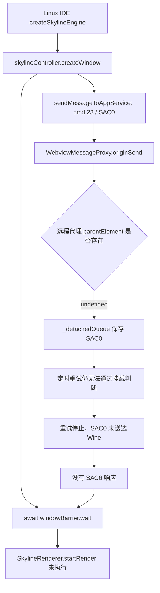

# Wine Electron 启动卡点分析（2026-09-15）

> 本文主体记录 15:21 前的修复前状态。随后按要求补齐了 `render-client.parentElement` 和 `send()`；原消息队列已打通，复测结果见文末“接口补齐后的复测”。

本次分析针对已经运行的 `skyline-client-server`（Wine / Windows Electron）与 `wechat-web-devtools-linux`（原生 Linux Electron），项目为 `awesome-skyline/examples/address-book`。排查时间为北京时间约 15:09–15:21，关键快照采集于 **15:17:16**。

## 结论

**当前卡在 Linux IDE 向 Wine appservice 发送创建窗口消息之前。** IDE 的 `createSkylineEngine()` 已调用 `skylineController.createWindow()`，但其中的 `SAC0 / SKYLINE_CREATE_WINDOW` 消息仍留在 Linux 侧 `WebviewMessageProxy._detachedQueue`。窗口 4 的 barrier 因收不到 `SAC6 / SKYLINE_CREATE_WINDOW_RESPONSE` 一直关闭，显示层的 `SkylineRenderer.startRender()` 未执行。

直接原因是 **远程 webview 代理与 IDE 消息代理使用的 DOM 接口不一致**：

- IDE 的 `originSend()` / `flushDetachedQueue()` 以 `getOriginElement().parentElement` 是否存在判断 webview 是否挂载。
- Skyline 接管之后，`getOriginElement()` 返回 Rust native client 创建的远程 `WebviewElement` 代理。该代理的 `parentElement` 为 `undefined`，但 `isConnected` 实测为 `true`。
- Wine 中真实的 `<webview id="appservice">` 已挂在 `#container` 下。IDE 却把它判为未挂载，消息进入 `_detachedQueue`，重试也因同一个判断而无法发出。
- 采样时队列仍有 5 条消息，包含窗口 4 的 `SAC0`，而 `_flushTimer` 已停止。这不是 appservice 正在慢慢创建引擎窗口。

同时确认一个后续接口缺口：远程代理的 **`send` 也是 `undefined`**，真实 webview 的 `send` 则是函数。仅修改 `parentElement` 判断还不够；实际发送分支调用的是 `element.send('host_' + channel, message)`，还需要补齐 `.send()` 的 RPC 转发。

以上结论由当前会话的队列、barrier、两端对象属性和源码共同证明。没有通过主动调用原生引擎或临时修补队列来推断结果，也没有验证补齐这两个接口后引擎能够完整启动。

## 当前进程与数据目录

| 程序 | 当前主进程 PID | 启动方式 / 调试入口 | 现有用户数据目录 |
| --- | --- | --- | --- |
| Skyline Server | `1226439` | `cache/electron-win32-x64/electron.exe --remote-debugging-port=9222 --enable-logging=stderr packages/electron`，由 `wine` 启动 | `C:\users\msojocs\AppData\Roaming\skyline-electron`，由运行中的 renderer / network 进程参数确认 |
| 微信开发者工具 | `1226804` | `electron/electron --inspect=9229 resources/app` | `/home/msojocs/.config/wechat-devtools`，通过 `app.getPath('userData')` 确认 |

Skyline host 的 `process.platform === 'win32'`，Electron 为 `36.6.0`；Linux IDE 的 `process.platform === 'linux'`，应用版本为 `2.02.2608070`。

`ss -tnp` 确认两条连接均已建立：

```text
Linux IDE main     1226804 → 127.0.0.1:3002 → Wine Skyline main
Linux IDE renderer 1226990 → 127.0.0.1:3001 → Wine Skyline host renderer
```

`9222/json/list` 中有 Skyline host 和“小程序逻辑层”目标；`9229/json/list` 是 Linux 主进程的 Node Inspector。逻辑层使用 Linux 编译服务提供的 `http://127.0.0.1:12584/appservice/.../mainframe?load`。显示层仍在 Linux IDE，URL 为 `http://127.0.0.1:12584/__pageframe__/pages/index/index`。

本次没有重启、杀进程、切换 profile、清理缓存或创建临时用户数据目录。原会话的 `persist:skyline_appservice_0` partition 保持不变。连接 Inspector / CDP 和短暂附加 IDE renderer debugger 用于读取状态；结束后该 debugger 已分离。

## 实测证据

完整的筛选后状态保存在 [2026-09-15-snapshot.json](./2026-09-15-snapshot.json)，可用 [collect-snapshot.mjs](./collect-snapshot.mjs) 重新采集。15:21:00 再次运行该脚本，确认 proxy 的全部已采集字段与保存的快照一致，包括原始 `SAC0`、5 条待发送消息和停止的重试定时器；barrier 仍关闭，两端进程 PID 未变。

### 1. 真正的消息堵塞位置

读取 Linux IDE 的 `IEnvMessagerService2.send` 绑定函数的 `[[BoundThis]]`，取得 `RendererMessagerService`，再读取：

```js
const proxy = messager._clientNameMap.get('WEBVIEW_APPSERVICE')[0];
proxy._ready;                  // true
proxy._msgList.length;         // 0
proxy._detachedQueue.length;   // 5
Boolean(proxy._flushTimer);    // false
messager._logicReady;          // true
[...messager._clientWaiters];  // []
```

`_detachedQueue` 的顺序如下；只保留本次定位需要的字段：

| 序号 | channel | cmd | command / 含义 |
| --- | --- | --- | --- |
| 1 | `__message__` | `HELLO` | 握手消息 |
| 2 | `__opened__` | — | 打开通知 |
| 3 | `__message__` | `23` | `SAC2`，销毁旧窗口 3 |
| 4 | `__message__` | `23` | **`SAC0`，创建窗口 4** |
| 5 | `__message__` | `48` | `AC11`，appservice preload 命令 |

其中 `SAC0` 的真实参数为：

```json
{
  "windowId": 4,
  "width": 390,
  "height": 844,
  "dpr": 2,
  "sharedMemoryKey": "skyline_4_1789455317491",
  "safeAreaInsets": { "left": 0, "top": 47, "right": 0, "bottom": 34 }
}
```

消息存在于这个尚未发送的队列，是定位本次卡点最直接的证据。不能把“TCP 已连通”“messager ready”或“页面加载完成”等同于这条业务消息已经送达。

### 2. Linux 代理与 Wine 真对象对照

| 属性 / 方法 | Linux `proxy._sender.getOriginElement()` | Wine `document.querySelector('#appservice')` |
| --- | --- | --- |
| `isConnected` | `true` | `true` |
| `parentElement` | **`undefined`** | DOM 元素，`id === 'container'` |
| `typeof send` | **`'undefined'`** | `'function'` |

Wine 的真实 appservice webContents id 为 `3`。其 preload 已是正确的 Windows 文件 URL：

```text
file:///Z:/home/msojocs/github/wechat-web-devtools-linux/resources/app/js/extensions/inject/preload/electron/index.js
```

### 3. 上下游状态符合“创建消息未发出”

| 检查点 | 当前值 | 说明 |
| --- | --- | --- |
| IDE `windowBarriers.get(4).isOpen()` | `false` | `createWindow()` 在等响应 |
| IDE 页面信息 `ready` / `renderer` | `false` / `skyline` | 入口页仍未 ready |
| Linux pageframe `document.readyState` | `complete` | 页面容器本身加载完成 |
| Linux pageframe canvas 数量 | `0` | 显示层尚未建立渲染 canvas |
| `typeof SkylineRenderer.instance` | `undefined` | `startRender()` 尚未创建实例 |
| Wine `typeof __global__` / `typeof __global__.__messager__` | `object` / `object` | preload 与消息对象存在 |
| Wine preload messager `_logicReady` | `true` | 不在等待逻辑层 ready |
| Wine preload messager `_pendingEvents.length` | `0` | 消息未积压在接收端 readiness 队列 |
| Wine preload messager 的 `cmd='23'` listener 数 | `1` | 已有 Skyline 命令监听器 |
| appservice `getApp()` | 有对象 | App 对象已创建 |
| appservice `getCurrentPages().length` | `0` | 业务页面尚未建立 |
| mainframe / instanceframe 的 Skyline 窗口数 | 均为 `0` | 不能只检查顶层 frame；本次两处都检查 |
| `typeof SkylineShell` | `undefined` | 尚未观察到原生引擎初始化 |
| `/dev/shm` 的 `skyline_*` 文件 | 无 | 辅助证据，不单独据此判定卡点 |

特别注意：这次 IDE store 中 **`simulator.appRoute.status === 'done'`**，同时 barrier 关闭、页面 `ready=false`、canvas 为 0。因此不能把该 route 状态单独当作 Skyline 首屏已完成的证据，也不能照搬旧分析里“route status 未完成”的描述。

## 代码链路与原因



### IDE 中的等待点

以下路径均相对于 `/home/msojocs/github/wechat-web-devtools-linux/resources/app/js/`。

`cbe8d9d8c183374e6db54086b379259e.js` 的 `createSkylineEngine()`：

```js
await A.skylineController.createWindow(t);
this.webview?.executeScript({ code: `SkylineRenderer.startRender(${JSON.stringify(t)})` });
```

`93fb707457ce375a8b560c655057c27f.js` 的 `createWindow()`：

```js
this.sendMessageToAppService(APPSERVICE_SKYLINE_COMMAND, {
  command: SKYLINE_CREATE_WINDOW, data: options
});
const barrier = this.addWindowBarrier(options.windowId);
await barrier.wait();
```

同一模块收到 `SKYLINE_CREATE_WINDOW_RESPONSE` 后才调用 `windowBarriers.get(windowId).open()`。发送动作没有被这里直接 `await`；当前可观察到的上层挂起点是等待 barrier。

### 消息为何进入队列后不再前进

`7dac069ee8bea6178dcfe412a1ae9cac.js` 的 `WebviewMessageProxy`，等价整理如下：

```js
originSend(channel, message) {
  const element = this._sender.getOriginElement();
  if (element?.parentElement) {
    this.flushDetachedQueue();
    element.send('host_' + channel, message);
    return;
  }
  this._detachedQueue.push({ channel, message });
  this.scheduleFlushDetachedQueue();
}

flushDetachedQueue() {
  const element = this._sender?.getOriginElement?.();
  if (!element?.parentElement) return;
  const queue = this._detachedQueue;
  this._detachedQueue = [];
  for (const entry of queue) element.send('host_' + entry.channel, entry.message);
  // 清理 timer ...
}
```

`scheduleFlushDetachedQueue()` 首次以 0 ms 调度，之后每 50 ms 重试，最多追加 40 次。`parentElement` 在代理上恒为 `undefined`，所以重试不可能改变判断结果。约 2 秒后停止主动重试，队列保留；本次在初次定位和 15:17 的快照中都读到了相同的 `SAC0` 和 inactive timer。

### 代理缺口来自哪里

IDE 的 `js/electron/preload.js` 在 `skyline_appservice` 接管分支中执行：

```js
const webview = controller.webview;
this.getOriginElement = function () { return webview; };
```

这个对象来自 native client，并不是 Linux DOM 中的真实 `<webview>`。

本仓库 [packages/native/src/client.rs](../../packages/native/src/client.rs#L94) 的 `ChromeWebViewElement` 类仅注册了 `addEventListener`、`executeJavaScript`、`getAttribute`、`getUserAgent`、`removeEventListener`、`setUserAgent`、`openDevTools`、`getWebContentsId`，以及 `src`、`style` 属性。

[同文件的通用 DOM 注册逻辑](../../packages/native/src/client.rs#L254) 额外提供 `reload`、`setAttribute`、`removeAttribute` 和 `isConnected`，**没有 `parentElement`，也没有 `send`**。IDE 当前加载的 `render-client.node` 是指向本仓库 `packages/native/build/x86_64-unknown-linux-gnu/render-client.node` 的符号链接；运行时属性读取也验证了这两个缺口。

真正挂载 webview 的代码在 [packages/typescript/src/render-process/controller.ts](../../packages/typescript/src/render-process/controller.ts#L38) 的 `mount()`，它把 Wine 内的 `_webview` append 到 `#container`。这个动作实测已完成，问题是 Linux 代理没有提供调用方所依赖的挂载状态接口。

## 排查过程与排除项

1. 核对进程、启动参数、两个仓库的已有修改和调试端口。确认当前是 Wine，而不是旧报告里的 Linux Skyline host；没有使用旧 PID 或旧 target id 下结论。
2. 连接 `9222`，分别读取 host / appservice 状态。确认 `win32`、正确的 `file:///Z:/...` preload、`__global__` 与 `__messager__`，排除旧报告中的两个前置卡点。
3. 连接 `9229`，枚举 Linux IDE 的 webContents，用 `executeJavaScript` 读取项目窗口和 pageframe。发现窗口 4 barrier 关闭，`SkylineRenderer.instance` 未创建。
4. 检查当前版本源码，沿 `createSkylineEngine → createWindow → sendMessageToAppService → WebviewMessageProxy` 追踪消息发送过程。
5. 读取 appservice preload 包装函数的 `[[Scopes]]`，检查其实际 messager。确认接收端 ready、无 pending events、有 Skyline command listener，避免仅凭全局对象存在判断消息通路正常。
6. 短暂附加 Linux 项目 renderer debugger，通过 `send` 的 `[[BoundThis]]` 读取 IDE messager / webview proxy，发现原始 `SAC0` 仍在 `_detachedQueue`，发送定时器已停止。
7. 对比 Linux 代理和 Wine 真对象，结合 Rust 类注册表确认 `parentElement` / `send` 接口缺口。整理成只读采集脚本，再次采样验证队列和两端状态保持一致。
8. 核对 debugger 已分离、两个原进程仍在运行。文档记录分析和修复方向，未修改业务实现。

日志补充：本次会话的 `WeappLog/logs/2026-09-15-14-55-13-450.log` 有 14:55:16 的 `CompileCache call executor` 和 14:55:17 的 `getSkylineFrame` 记录。结合已加载的 appservice / pageframe，说明编译与页面服务已经推进到这些步骤；单凭“开始执行编译器”的日志不能宣称所有编译任务完成。

host console 的历史记录有容量限制，本次 CDP 只返回最近 1000 条。未看到创建窗口异常不能证明没有发生过异常；本结论以当前未发送的原始 `SAC0`、队列状态和发送分支源码为依据。

## 与旧报告的关系

- [2026-09-13 分析](./分析.md) 记录的是 Linux 原生 Skyline host 加载 Windows PE 模块失败。本次 host 已是 `win32`，不能继续把“无效 ELF 头”认定为当前原因。
- [Wine preload 路径报告](../skyline-wine-preload-path.md) 记录的是 preload 缺少 `Z:` 盘符导致 `__global__` 缺失。本次 preload URL 和相关全局对象均已正确存在。
- 两个原生引擎相关 `.node` 文件当前仍是 PE32+，这与 Windows Electron 环境相符，但**没有在本次排查中主动 require / 初始化引擎来验证其可用性**。当前证据把首个阻塞点定位在消息发送侧，不能据此保证后续 native addon、共享内存或首帧流程正常。

## 后续修复与验收方向

本次交付范围为定位和记录，以下为基于证据的修复建议：

1. 让 IDE 消息代理的挂载判断适配远程 webview。现有 `isConnected` 已被代理且实测为 `true`，可以评估以它判断挂载状态；需要同时处理 `originSend()` 和 `flushDetachedQueue()`，保留尚未挂载时的排队行为。
2. 在 native `ChromeWebViewElement` 的方法注册中补齐 `send` 的 RPC 转发，并更新 IDE 实际加载的 Linux `render-client.node`。不要仅把 `parentElement` 伪装成 truthy 值，否则下一步会调用不存在的 `.send()`。
3. 验收时应逐步观察：`SAC0` 离开发送队列 → Wine appservice 收到命令 → 创建 Skyline 窗口 → 返回 `SAC6` → barrier 打开 → pageframe 创建 renderer / canvas → 页面首帧显示。若在后续阶段出现新错误，应另行定位，不能将“队列已清空”视为端到端成功。

## 复查命令

保持两套程序及原用户数据目录，使用 Node.js 22+，在本仓库根目录执行：

```bash
curl -s http://127.0.0.1:9222/json/list
curl -s http://127.0.0.1:9229/json/list
node docs/skyline-startup-stall/collect-snapshot.mjs > snapshot.json
```

脚本只连接现有调试入口、读取状态和输出 JSON，不启动 Electron、不清队列、不触发编译，也不修改 profile。它依赖当前 IDE bundle 的模块文件名和内部字段；升级 IDE 后若模块变化会明确报错。JSON 未收集 Cookie、登录凭据或完整用户配置。

工作区说明：排查开始时 `tools/start-electron-wine.sh` 已有添加 `--enable-logging=stderr` 的用户修改，未改动它；Linux 仓库也已有自己的修改，未改动。本次新增本报告、状态快照和采集脚本，并给旧分析补充当前报告入口。

## 接口补齐后的复测

用户随后要求添加这两个接口，已完成以下改动：

- native `ChromeWebViewElement` 注册只读 `parentElement` 和 `send(channel, ...args)`。
- 服务端将父节点编码为 `Object` 句柄，避免递归序列化带循环引用的 DOM；重复读取复用句柄。
- 父节点不存在时保留 DOM 的 `null` 语义；其他 RPC 值继续沿用原来的解码行为。
- 构建了 Linux native 产物和 TypeScript 服务端 bundle。替换 `.node` 文件时采用同目录临时文件加原子 rename，避免覆盖运行中进程已映射的二进制 inode。

验证结果：

| 验证 | 结果 |
| --- | --- |
| 新增 native 回归用例 | 通过：未挂载 / 卸载时为 `null`、挂载后读取父节点、父节点身份稳定、只读属性、`send` 脱离对象后调用、多个参数转发、远端错误传播 |
| TypeScript RPC 与 dialog 测试 | 19 项通过，包含循环 DOM 只编码句柄的回归用例 |
| 重建后的 main-client 测试 | 4 项通过 |
| native 全量测试 | 9/10 通过；旧综合用例调用未注册的 `showDevTools`，期待 `Not implemented`，实际为 `TypeError`。在单独导出的未修改 `HEAD` 源码和测试上复现了同样失败 |
| Linux 与 Wine 实际会话 | 父节点可读取、发送队列清空、`SAC0` 已通过 RPC 发送到真实 webview |

运行验证时，热重载未能恢复 Wine RPC 服务，随后完整重启了两个开发进程。仍使用原来的 Wine profile 和 `/home/msojocs/.config/wechat-devtools`，没有创建临时用户数据目录，也没有清理缓存。Linux 从本次执行环境启动时遇到 SUID sandbox helper 配置错误，因此此次调试启动额外使用了 `--no-sandbox`，没有修改启动脚本或系统 sandbox 配置。

复测进程为 Wine host Linux PID `1249209`、Linux IDE PID `1249456`。实际读取的结果保存在 [接口修复后快照](./2026-09-15-webview-api-snapshot.json)：

```json
{
  "queueCount": 0,
  "ready": true,
  "parentId": "container",
  "parentStable": true,
  "isConnected": true,
  "sendType": "function"
}
```

Wine 运行日志中的关键顺序如下（仅摘录与验证有关的字段）：

```text
15:37:58.226  Received message => action=send, channel=host___message__, cmd=23,
             command=SAC0, windowId=2, width=390, height=844, dpr=2
15:37:58.226  dynamic call HTMLElement.send; result undefined
15:37:59.622  [skyline] skyline 版本号: 1.4.21
             AppSnapshot DoPrepareIsolate
             devtools.dart main args [2, ..., 390, 844, ...]
             SkylineApplication:initRuntimeHolderPtr
             CustomElement:registerCustomElements
             WaLoad:setupFFIFunctions
             Renderer process crashed
```

因此，修复前的“消息滞留 `_detachedQueue`”卡点已经解除。后续仍观察到 **Skyline 原生运行时初始化后 renderer 崩溃**；这次没有定位其崩溃根因，也没有将首屏视为已修复。崩溃后完整旧版采集脚本会在 appservice `Runtime.evaluate` 上超时，因此修复后快照只读取仍可响应的 Linux 消息代理。两个宿主主进程仍运行，临时附加的 IDE renderer debugger 已分离。

### HTMLDivElement 类型映射重构（16:25）

服务端使用 `remoteInstanceTypes.HTMLDivElement = 'HTMLDivElement'`，Rust render-client 注册同名代理类，
目前仅提供只读 `id` 属性，`methods` 为空，`webview_element` 为 `false`，不附加通用 webview 接口。
删除了 `action === 'parentElement_propertyResult'` 特判，`HTMLDivElement` 通过通用对象分支编码为带类型的句柄，
属性和方法返回值、数组元素、嵌套数据以及回调参数均按类型识别。对象和数组的句柄编码统一优先复用已有实例 ID。
通用对象分支保留 `null`，避免把未挂载父节点转换成 truthy 的 `{}`；普通数据对象继续按值传输。

RPC 与 dialog 测试共 21 项通过，覆盖不同 action 下的循环 DOM 对象、句柄身份复用、嵌套普通数据、
空值和回调参数。4 项相关 native 回归测试通过，其中验证了 `HTMLDivElement` 类名、只读 `id`、
重复读取身份一致、挂载 / 卸载状态以及消息转发。已重建 Linux `render-client.node` 以及 `render-server.js` / `main-server.js`。
本次类型映射重构没有再次重启程序；
上方真实会话快照记录的是此前接口补齐后的运行验证，不能视为这次重构后的新会话验证。

### 最终空值解码行为

按后续要求，删除 Rust 属性 getter 中针对 `parentElement` 的 `null` 特判，统一调用 `state.decode()`。
未挂载或卸载时，服务端仍发送 `null`，客户端按现有 RPC 规则得到 `undefined`。
这不影响 IDE 的 `if (element?.parentElement)` 挂载判断。native 测试的两个空值断言及使用说明已同步调整；
上文“返回 `null`”的描述记录的是最初实现。

TypeScript 服务端通用对象分支的 `if (result === null) return null` 保留，避免将空值序列化成 truthy 的 `{}`。
